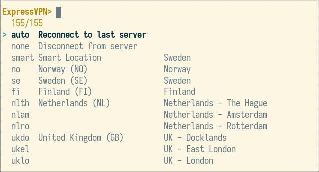

# Fish ExpressVPN

Fish plugin for controlling [ExpressVPN][1] via [`fzf`][2]. This is really just
a simple wrapper around the command-line utility `expressvpn`. Instead of typing 
`expressvpn list all`, `expressvpn connect <server>`, and `expressvpn disconnect`,
you can now use a single command `vpn`, which exposes these functions via `fzf`:

In addition to the special items `auto` and `none`, all ExpressVPN servers 
can be searched, selected, and then connected to from the `fzf` interface.

Just install `expressvpn` and `fzf`, and then add this plugin via [`fisher`][3]:

    fisher add jabirali/fish-expressvpn

Then type `vpn` when you wish to connect/disconnect from the VPN service.

[1]: https://www.expressvpn.com/
[2]: https://github.com/junegunn/fzf
[3]: https://github.com/jorgebucaran/fisher
